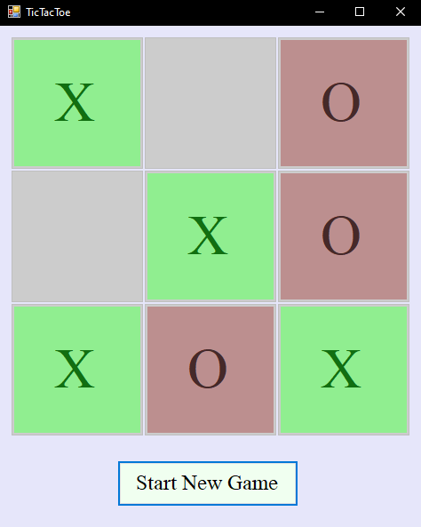

# TicTacToe

It's TicTacToe, but with a smarter computer that will try to prevent you from winning.

## Contents

- [Features](#features)
- [Installation](#installation)
- [Functionality and Screenshots](#functionality-and-screenshots)
- [Credits](#credits)

## Features

- Play against a computer opponent.
- This opponent will check if it is able to win the game and play the correct move, as well as checking (if it can't win on its current move) if you are able to win on your next move and plays appropriately to prevent you from winning.
- Able to start a new game repeatedly at will.

## Installation

- Clone the repo with `https://github.com/K-Kocak/TicTacToe.git`
- Open up the .sln file and that's it.
- There will be three projects, the "TicTacToe" file is old code before I made the UI, make sure the "TicTacToeGUI" is set as the startup project.

## Functionality and Screenshots

*TicTacToe UI*

The UI for the program that the player will see when the program is launched. 
- X (you) have your squares lit up as green while the opponent (O) has theirs light up as brown. I decided to add in colours for the moves because it made the state of the game much more clearer to the player as opposed to a full grey layout.
- A new game can be started at any point with the click of a button at the bottom.
- Upon winning, losing, or when the board is completely full, a message box appears to announce who won the game (or if it's a draw).
- The computer (O) will try to prevent the player from winning if they are one move from winning and also checking if it itself is one move from winning, and will play the best move.
- If neither player can immediately win, then the computer will pray randomly.

## Credits

### Tools

- Just C#

[Back to Top](#contents)
